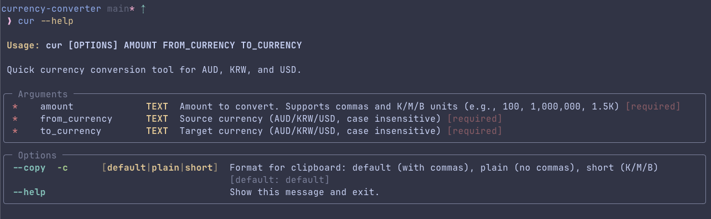
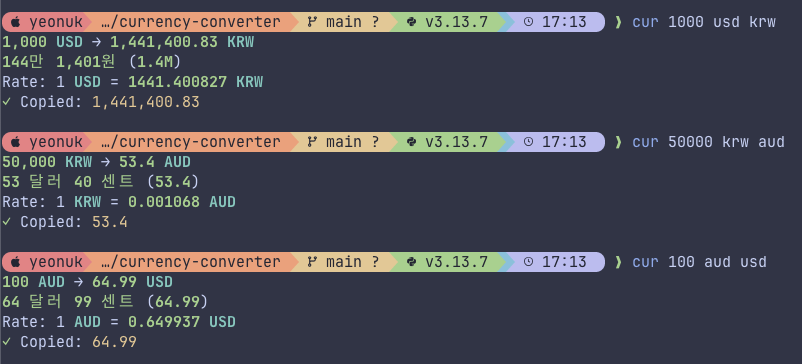
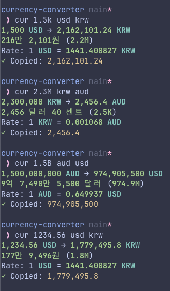
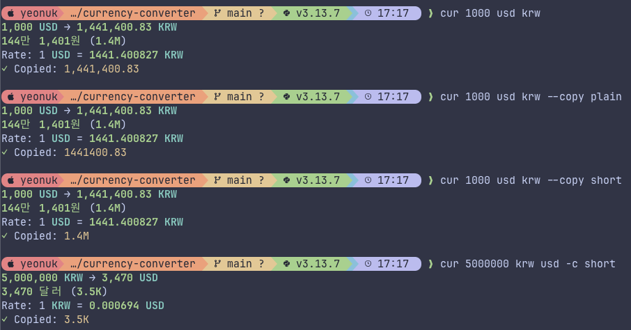

## Project Overview

A command-line interface tool for quick currency conversion between AUD, KRW, and USD. Originally built to replace broken Alfred workflow, this tool is designed for fast access via Ghostty's quick terminal feature with simple, intuitive commands.

## Key Features

**🎨 Smart Output Formatting**

- **Multi-format display**: Shows results in numbers, Korean text (한글), and short units (K/M/B) simultaneously
- Example: `1,385,000 KRW` → `138만 5천원 (1.39M)`
- Makes it easy to understand amounts in different representations at a glance

**⌨️ Flexible Input Options**

- **Comma-separated numbers**: `1,000`, `1,000,000` for better readability
- **Unit suffixes**: `1.5K` (thousand), `2.3M` (million), `1.5B` (billion)
- **Case-insensitive**: `1k`, `1K`, `1.5m`, `1.5M` all work
- **Decimal support**: `1234.56`, `1.5k`

## Installation

### Using uv (Recommended)

```bash
# Install from the current directory
uv tool install .

# Or install in editable mode for development
uv tool install --editable .
```

### Requirements

- Python 3.10+
- [uv](https://docs.astral.sh/uv/) package manager

### Development

```bash
# Run directly without installation (recommended for development)
uv run cur 100 usd krw

# Run tests
uv run pytest

# Install dependencies
uv sync
```

## Usage

### Help



### Basic Currency Conversion



### Input with K/M/B Units



### Copy options



## Credits

This tool uses the free API provided by [ExchangeRate-API](https://www.exchangerate-api.com/) for currency conversion rates.
